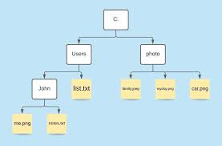
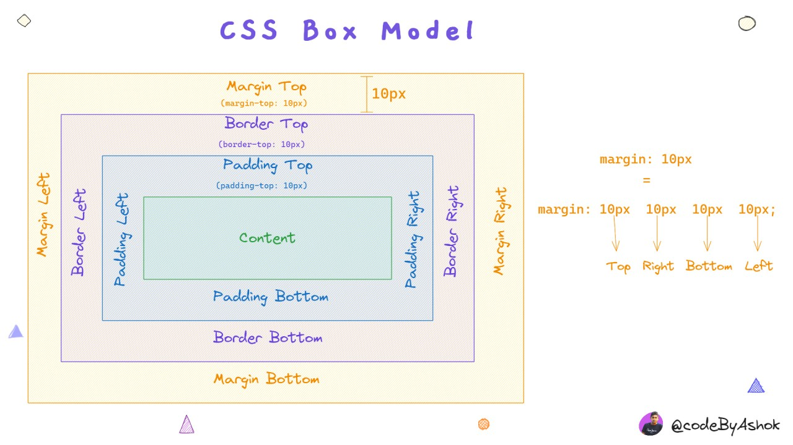
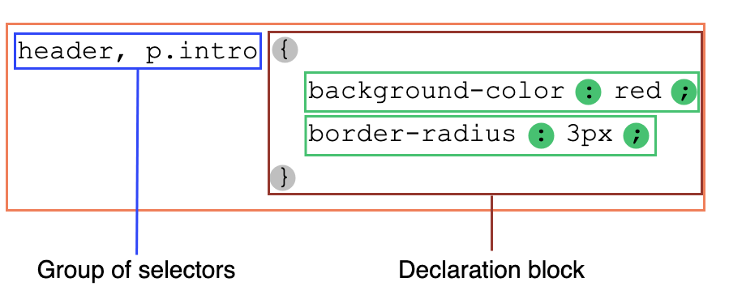

# Lesson 1

### Repeat last lesson

- attribute (name/value)
- tag scheme
- tag head (how connect css)
- frontend/backend (client/server)

### Lesson

- [path/files (explorer)](#основная-информация-о-путях-и-файлах-pathfiles-explorer)
- [block/inline elements](#блочные-и-встроенныестрочные-элементы-block-and-inline-elements)
- [block model](#file-основная-информация-о-путях-и-файлах-pathfiles-explorer)
- [selectors/class/id](#селекторы-классы-id)
- [positions](#позиционирование-свойства-position)

# Основная информация о путях и файлах (Path/Files Explorer)



При работе с веб-разработкой важно понимать, как организовывать и находить файлы в проекте. Вот некоторые основные сведения о путях и файлах, которые помогут вам в этом:

## Файловая система

Файловая система - это иерархическая структура, в которой хранятся файлы и папки. В веб-разработке обычно используются файлы HTML, CSS, JavaScript, изображения, шрифты и другие ресурсы.

## Пути к файлам

Путь к файлу - это последовательность папок и имен файлов, которая определяет местоположение файла в файловой системе. Существует два типа путей:

1. **Абсолютный путь**: начинается с корневой директории файловой системы и содержит полный путь к файлу. Например: `C:\Users\UserName\Documents\project\index.html`.
2. **Относительный путь**: начинается от текущего расположения файла и содержит путь к целевому файлу, относительно этого расположения. Например, если вы находитесь в файле `style.css` в папке `css`, и вам нужно подключить изображение из папки `images`, то относительный путь будет выглядеть так: `../images/image.png`.

## Проводник (File Explorer)

Проводник - это приложение, которое позволяет управлять файлами и папками в файловой системе. В веб-разработке вы будете часто использовать проводник для создания, переименования, перемещения и удаления файлов и папок.

## Организация файлов и папок

Чтобы облегчить работу с файлами и папками в веб-проекте, рекомендуется следовать нескольким правилам организации:

1. Создавайте отдельные папки для разных типов файлов (HTML, CSS, JavaScript, изображения и т. д.).
2. Используйте осмысленные имена для файлов и папок, чтобы легко понимать их назначение.
3. Избегайте использования пробелов и специальных символов в именах файлов и папок.
4. Создавайте подпапки, если количество файлов в папке становится слишком большим.

Следуя этим рекомендациям, вы сможете легко навигировать по файлам и папкам в вашем веб-проекте и эффективно управлять ими.

# Блочные и встроенные(строчные) элементы (Block and Inline Elements)

В CSS существует два основных типа элементов: блочные (block) и встроенные (inline). Они отличаются тем, как они отображаются и взаимодействуют с другими элементами на странице.

## Блочные элементы (Block Elements)

Блочные элементы занимают всю доступную ширину родительского контейнера и создают новую строку перед и после себя. Они обычно используются для структурирования контента, такого как заголовки, абзацы, списки и колонки.

Примеры блочных элементов: `<div>`, `<h1>` - `<h6>`, `<p>`, `<ul>`, `<ol>`, `<li>`, `<section>`, `<article>`, `<header>`, `<footer>`, `<form>`, `<table>`.

## Встроенные элементы (Inline Elements)

Встроенные элементы занимают только необходимое пространство для отображения своего контента и не создают новых строк. Они обычно используются для форматирования текста и небольших элементов, таких как ссылки, изображения и кнопки.

Примеры встроенных элементов: `<span>`, `<a>`, ``, `<input>`, `<button>`, `<label>`, `<strong>`, `<em>`, `<sub>`, `<sup>`, `<code>`.

## Изменение типа элемента

Свойство CSS `display` позволяет изменять тип элемента с блочного на встроенный и наоборот. Например, вы можете преобразовать встроенный элемент `<span>` в блочный, установив `display: block;`, или сделать блочный элемент `<div>` встроенным, установив `display: inline;`.

<br>

# Блочная модель

# Краткое описание модели блоков (Block Model)

Модель блоков (Block Model) в CSS определяет, как элементы блочного типа занимают пространство на странице. Основные компоненты модели блоков включают:

1. **Content area (Область контента)**: область, занимаемая содержимым элемента, таким как текст, изображения и т. д.
2. **Padding (Внутренние отступы)**: пространство между областью контента и границами элемента.
3. **Border (Границы)**: линии, окружающие область контента и внутренние отступы.
4. **Margin (Внешние отступы)**: пространство между границами элемента и соседними элементами или границами родительского контейнера.

Свойства CSS, связанные с моделью блоков, включают:

* `width` и `height`: задают ширину и высоту области контента.
* `padding`: задает внутренние отступы.
* `border`: задает границы.
* `margin`: задает внешние отступы.

Модель блоков также определяет, как элементы взаимодействуют друг с другом и с родительскими контейнерами. Например, блочные элементы по умолчанию заполняют всю доступную ширину родительского контейнера, а встроенные элементы занимают только необходимое пространство.

# Дополнительные особенности блочных и встроенных элементов

Блочные и встроенные элементы имеют разные свойства, которые могут быть применены к ним. Вот некоторые особенности, которые стоит учитывать при работе с этими типами элементов:

## Свойства, работающие с блочными элементами

Блочные элементы поддерживают следующие свойства:

1. `width` и `height`: задают ширину и высоту элемента.
2. `margin`: задает внешние отступы вокруг элемента.
3. `padding`: задает внутренние отступы вокруг контента элемента.
4. `border`: задает границу вокруг элемента.

## Свойства, работающие со встроенными элементами

Встроенные элементы поддерживают ограниченный набор свойств:

1. `margin-left` и `margin-right`: задают горизонтальные внешние отступы вокруг элемента.
2. `padding`: задает внутренние отступы вокруг контента элемента.
3. `border`: задает границу вокруг элемента.

Обратите внимание, что встроенные элементы не поддерживают вертикальные внешние отступы (`margin-top` и `margin-bottom`), а также свойства `width` и `height`.

## Изменение типа элемента и свойств

Когда вы изменяете тип элемента с помощью свойства `display`, свойства, которые ранее не работали с этим элементом, могут стать доступными. Например, если вы преобразуете встроенный элемент `<span>` в блочный с помощью `display: block;`, то свойства `width`, `height`, `margin-top` и `margin-bottom` начнут работать с этим элементом.

Кроме того, существуют другие значения свойства `display`, которые позволяют изменять поведение элементов, такие как `inline-block`, `flex`, `grid` и другие. Эти значения предоставляют дополнительные возможности для верстки и позиционирования элементов.


# Селекторы, Классы, ID

## Селекторы


Селекторы CSS используются для выбора элементов, к которым будут применены стили. Существует несколько типов селекторов:

1. **Элементный селектор**: выбирает элементы по имени тега.
```css
p {
  color: blue;
}
```
2. **Классовый селектор**: выбирает элементы по значению атрибута `class`.
```css
.example {
  background-color: yellow;
}
```
3. **ID-селектор**: выбирает элемент по значению атрибута `id`.
```css
#header {
  font-size: 24px;
}
```
4. **Атрибутный селектор**: выбирает элементы на основе их атрибутов и значений.
```css
a[href="https://example.com"] {
  color: red;
}
```

## Классы

Классы в CSS используются для применения стилей к группе элементов. Атрибут `class` может быть добавлен к любому HTML-элементу и использоваться для выбора элементов с помощью классового селектора.

```html
<div class="example">Пример текста</div>
<p class="example">Еще один пример текста</p>
```

```css
.example {
  color: purple;
  font-weight: bold;
}
```

## ID

ID в CSS используются для применения стилей к уникальному элементу. Атрибут `id` может быть добавлен к любому HTML-элементу и использоваться для выбора элемента с помощью ID-селектора.

```html
<header id="site-header">
  <h1>Заголовок сайта</h1>
</header>
```

```css
#site-header {
  background-color: #333;
  color: white;
  padding: 20px;
}
```


# Позиционирование (Свойства Position)

## Static (Статическое)

- Это значение по умолчанию для всех элементов.
- Статически позиционированные элементы следуют нормальному потоку документа.
- Свойства `top`, `right`, `bottom` и `left` не влияют на статически позиционированные элементы.

## Relative (Относительное)

- Относительно позиционированные элементы следуют нормальному потоку документа.
- Свойства `top`, `right`, `bottom` и `left` используются для перемещения элемента относительно его исходного положения.
- Относительное позиционирование не влияет на расположение других элементов.

## Absolute (Абсолютное)

- Абсолютно позиционированные элементы вынимаются из нормального потока документа.
- Свойства `top`, `right`, `bottom` и `left` используются для установки положения элемента относительно ближайшего родительского элемента с позиционированием, отличающимся от статического.
- Абсолютное позиционирование может перекрывать другие элементы.

## Fixed (Фиксированное)

- Фиксированные элементы вынимаются из нормального потока документа.
- Свойства `top`, `right`, `bottom` и `left` используются для установки положения элемента относительно окна просмотра (viewport).
- Фиксированные элементы остаются неподвижными при прокрутке страницы.

## Sticky (Прилипающее)

- Прилипающее позиционирование является гибридом относительного и фиксированного позиционирования.
- Элемент ведет себя как относительно позиционированный, пока не достигнет заданного порога прокрутки.
- После достижения порога прокрутки элемент ведет себя как фиксированный, оставаясь на месте при прокрутке.