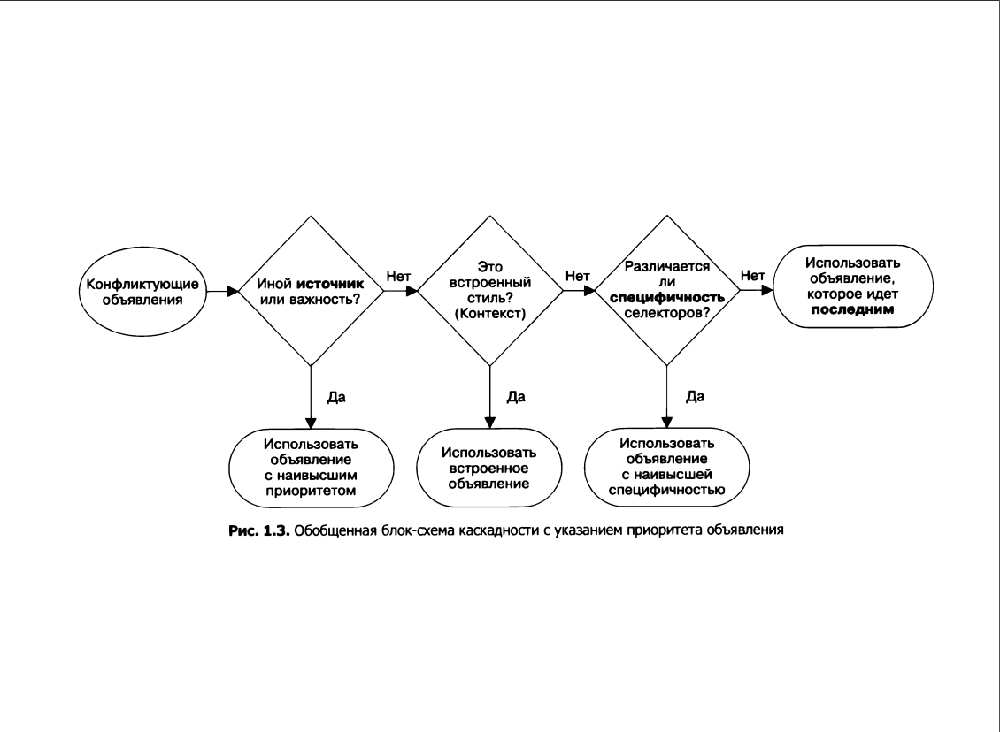
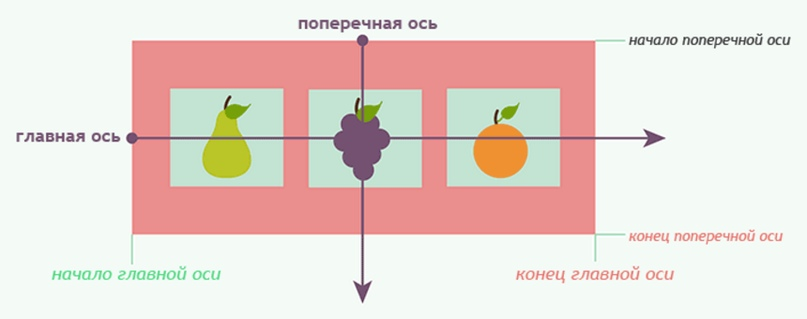
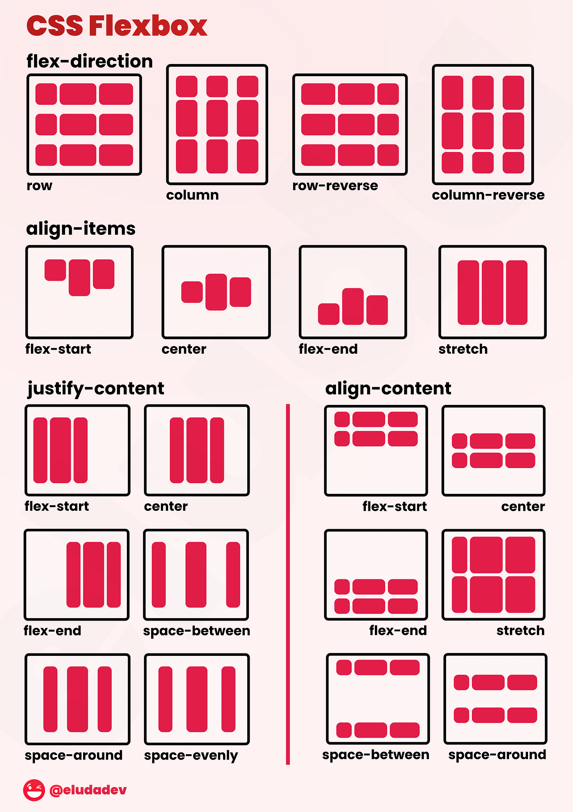

# Lesson 2

### Repeat last lesson

- глобальные/относительные пути
- Блочные строчные элементы
- Селекторы CSS

## Summary
- [Каскадность, Наследование и Специфичность](#каскадность-наследование-и-специфичность-в-css)
- [Flexbox](#flexbox)
- [Git](#изучение-git)


## Каскадность, Наследование и Специфичность в CSS

CSS (Cascading Style Sheets) - это язык стилей, который используется для оформления веб-страниц. Он позволяет разработчикам создавать красивые и удобные для пользователя веб-сайты. В CSS есть три основных принципа, которые нужно знать для создания эффективных таблиц стилей: каскадность, наследование и специфичность.


### Каскадность (Cascading)

Каскадность - это способ, которым CSS применяет стили к элементам на веб-странице. Когда несколько стилей могут быть применены к одному элементу, каскадность помогает браузеру определить, какой стиль имеет наивысший приоритет.

В CSS есть несколько способов определить стили для элементов:

* Стили могут быть определены непосредственно в теге элемента с помощью атрибута style.
* Стили могут быть определены в теге style внутри документа HTML.
* Стили могут быть определены в отдельном файле CSS.

При определении стилей для элемента с помощью различных методов, каскадность помогает браузеру определить, какой стиль имеет наивысший приоритет. Стили, определенные непосредственно в теге элемента, имеют наивысший приоритет, затем следуют стили, определенные в теге style, и, наконец, стили, определенные в отдельном файле CSS.

Пример:
```css
p {
  color: blue;
}

.text {
  color: red;
}

<p class="text" style="color: green;">Этот текст будет зеленым, потому что стиль, определенный непосредственно в теге элемента, имеет наивысший приоритет.</p>
```

### Наследование (Inheritance)

Наследование - это способ, которым элементы на веб-странице могут автоматически получать стили от своих родительских элементов. Это помогает избежать повторения кода и упрощает управление стилями.

В CSS все элементы на странице формируют дерево элементов. Каждый элемент имеет одного родительского элемента, за исключением корневого элемента, который не имеет родительского элемента. Когда браузер отображает страницу, он проходит по дереву элементов и применяет стили к каждому элементу в соответствии с его родительским элементом.

Пример:
```css
body {
  font-size: 16px;
  font-family: Arial, sans-serif;
}

<body>
  <div>
    <p>Этот текст будет иметь размер шрифта 16px и шрифт Arial, потому что он унаследует эти стили от тега body.</p>
  </div>
</body>
```

### Специфичность (Specificity)

Специфичность - это способ, которым браузер определяет, какой селектор CSS имеет наивысший приоритет при применении стилей к элементу. Каждый селектор имеет определенное значение специфичности, и браузер использует эти значения для определения, какой селектор имеет наивысший приоритет.

Значение специфичности селектора определяется количеством и типом селекторов, которые используются для его определения. Селекторы могут быть разделены на четыре группы:

* Селекторы тегов (например, p, div, span)
* Селекторы классов (например, .text, .header, .footer)
* Селекторы идентификаторов (например, #text, #header, #footer)
* Селекторы атрибутов (например, [type="text"], [href^="http"])

Каждый селектор имеет определенное значение специфичности, которое вычисляется по формуле:
```javascript
a = количество селекторов идентификаторов
b = количество селекторов классов, атрибутов и псевдоклассов
c = количество селекторов тегов
```
Значение специфичности селектора определяется как конкатенация значений a, b и c.

Пример:
```css
p {
  color: blue;
}

#text {
  color: red;
}

<p id="text">Этот текст будет красным, потому что селектор "#text" имеет большую специфичность, чем селектор "p".</p>
```

### Итого

Каскадность, наследование и специфичность - это три основных принципа, которые используются в CSS для определения стилей для элементов. Понимание этих принципов помогает создавать эффективные и легко управляемые таблицы стилей.


## Flexbox

Flexbox (Flexible Box Layout) - это модель расположения элементов в CSS, которая позволяет создавать гибкие и адаптивные макеты. Flexbox позволяет легко выравнивать элементы по вертикали и горизонтали, а также менять их порядок и размеры в зависимости от размера экрана.

### Основные концепции Flexbox

Flexbox состоит из двух основных компонентов: контейнера (flex container) и элементов (flex items). Контейнер - это родительский элемент, который содержит элементы. Элементы - это дочерние элементы, которые располагаются внутри контейнера.

Flexbox использует две оси для расположения элементов: главную ось (main axis) и поперечную ось (cross axis). Главная ось проходит горизонтально, а поперечная ось проходит вертикально.


Flexbox также использует несколько свойств для управления расположением элементов внутри контейнера:

* `display` - свойство, которое определяет, является ли элемент контейнером Flexbox.
* `flex-direction` - свойство, которое определяет направление главной оси.
* `justify-content` - свойство, которое определяет выравнивание элементов по главной оси.
* `align-items` - свойство, которое определяет выравнивание элементов по поперечной оси.
* `flex-wrap` - свойство, которое определяет, переносятся ли элементы на новую строку или столбец.


### Примеры использования Flexbox

#### Пример 1: Создание простого макета с горизонтальным выравниванием

В этом примере мы создадим простой макет с горизонтальным выравниванием элементов.

HTML-код:
```html
<div class="container">
  <div class="item">Item 1</div>
  <div class="item">Item 2</div>
  <div class="item">Item 3</div>
</div>
```
CSS-код:
```css
.container {
  display: flex;
  justify-content: space-between;
}

.item {
  background-color: #eee;
  padding: 20px;
  font-size: 24px;
}
```
В этом примере мы определили контейнер с классом "container" и добавили ему свойство `display: flex`, чтобы сделать его контейнером Flexbox. Мы также добавили свойство `justify-content: space-between`, чтобы выровнять элементы по главной оси с равным расстоянием между ними.

Для элементов мы добавили класс "item" и задали им фон, отступы и размер шрифта.


#### Пример 2: Создание вертикального макета с выравниванием по центру

В этом примере мы создадим вертикальный макет с выравниванием элементов по центру.

HTML-код:
```html
<div class="container">
  <div class="item">Item 1</div>
  <div class="item">Item 2</div>
  <div class="item">Item 3</div>
</div>
```
CSS-код:
```css
.container {
  display: flex;
  flex-direction: column;
  align-items: center;
}

.item {
  background-color: #eee;
  padding: 20px;
  font-size: 24px;
  margin-bottom: 20px;
}
```
В этом примере мы изменили направление главной оси на вертикальное, добавив свойство `flex-direction: column`. Мы также добавили свойство `align-items: center`, чтобы выровнять элементы по поперечной оси по центру.

Для элементов мы добавили отступы и нижний отступ, чтобы разделить их.

#### Пример 3: Создание адаптивного макета с переносом элементов

В этом примере мы создадим адаптивный макет с переносом элементов на новую строку, если они не помещаются в один ряд.

HTML-код:
```html
<div class="container">
  <div class="item">Item 1</div>
  <div class="item">Item 2</div>
  <div class="item">Item 3</div>
  <div class="item">Item 4</div>
  <div class="item">Item 5</div>
</div>
```
CSS-код:
```css
.container {
  display: flex;
  flex-wrap: wrap;
  justify-content: space-between;
}

.item {
  background-color: #eee;
  padding: 20px;
  font-size: 24px;
  width: 30%;
  margin-bottom: 20px;
}
```
В этом примере мы добавили свойство `flex-wrap: wrap`, чтобы элементы переносились на новую строку, если они не помещаются в один ряд. Мы также задали элементам ширину 30%, чтобы они занимали одну треть контейнера.

Для элементов мы добавили отступы и нижний отступ, чтобы разделить их.

### Итого

Flexbox - это мощная модель расположения элементов в CSS, которая позволяет создавать гибкие и адаптивные макеты. Flexbox использует контейнер и элементы, а также несколько свойств для управления расположением элементов внутри контейнера. Flexbox позволяет легко выравнивать элементы по вертикали и горизонтали, а также менять их порядок и размеры в зависимости от размера экрана.
 

## Изучение Git


Git - это распределенная система управления версиями, которая позволяет отслеживать изменения в файлах и работать над проектами совместно с другими людьми. Git позволяет создавать резервные копии проектов, откатывать изменения, сравнивать различные версии файлов и разрешать конфликты между изменениями.

### Основные концепции Git

Git использует несколько основных концепций:

* Репозиторий (Repository) - это хранилище файлов и папок, в котором отслеживаются изменения.
* Коммит (Commit) - это фиксированное состояние репозитория, которое содержит изменения, внесенные в файлы.
* Ветка (Branch) - это отдельная линия разработки, которая позволяет работать над проектом независимо от других веток.
* Слияние (Merge) - это процесс объединения изменений из двух разных веток в одну.
* Конфликт (Conflict) - это ситуация, когда Git не может автоматически объединить изменения из двух разных веток и требуется ручное разрешение конфликта.

### Установка Git

Чтобы установить Git, необходимо скачать и установить его с официального сайта Git. После установки Git необходимо настроить его, указав имя пользователя и адрес электронной почты, которые будут использоваться для коммитов.

### Базовые команды Git

#### Инициализация репозитория

Чтобы инициализировать репозиторий Git, необходимо выполнить команду `git init` в папке проекта. Эта команда создает скрытую папку `.git`, в которой хранятся все файлы и папки репозитория.

#### Добавление файлов в репозиторий

Чтобы добавить файлы в репозиторий, необходимо выполнить команду `git add <имя файла>`. Эта команда добавляет файл в индекс, который является промежуточным буфером между рабочей областью и репозиторием.

#### Фиксация изменений

Чтобы зафиксировать изменения в репозитории, необходимо выполнить команду `git commit -m "<сообщение коммита>"`. Эта команда создает новый коммит, который содержит все изменения, добавленные в индекс.

#### Просмотр истории коммитов

Чтобы просмотреть историю коммитов, необходимо выполнить команду `git log`. Эта команда выводит список всех коммитов, сделанных в репозитории.


### Работа с удаленными репозиториями

Git позволяет работать с удаленными репозиториями, которые находятся на других компьютерах или серверах. Это позволяет совместно работать над проектами с другими людьми и делиться кодом.

#### Добавление удаленного репозитория

Чтобы добавить удаленный репозиторий, необходимо выполнить команду `git remote add <имя удаленного репозитория> <адрес удаленного репозитория>`. Эта команда добавляет удаленный репозиторий к локальному репозиторию.

Например, чтобы добавить удаленный репозиторий с адресом `https://github.com/user/repo.git` и именем `origin`, необходимо выполнить команду `git remote add origin https://github.com/user/repo.git`.

#### Отправка изменений в удаленный репозиторий

Чтобы отправить изменения в удаленный репозиторий, необходимо выполнить команду `git push <имя удаленного репозитория> <имя ветки>`. Эта команда отправляет все коммиты из локальной ветки в указанную ветку удаленного репозитория.

Например, чтобы отправить изменения из локальной ветки `master` в удаленный репозиторий `origin`, необходимо выполнить команду `git push origin master`.

#### Получение изменений из удаленного репозитория

Чтобы получить изменения из удаленного репозитория, необходимо выполнить команду `git pull <имя удаленного репозитория> <имя ветки>`. Эта команда загружает все коммиты из указанной ветки удаленного репозитория и объединяет их с локальной веткой.

Например, чтобы получить изменения из удаленного репозитория `origin` и ветки `master`, необходимо выполнить команду `git pull origin master`.

#### Удаление удаленного репозитория

Чтобы удалить удаленный репозиторий, необходимо выполнить команду `git remote remove <имя удаленного репозитория>`. Эта команда удаляет указанный удаленный репозиторий из локального репозитория.

Например, чтобы удалить удаленный репозиторий `origin`, необходимо выполнить команду `git remote remove origin`.

### Итого

Git - это мощная система управления версиями, которая позволяет отслеживать изменения в файлах и работать над проектами совместно с другими людьми. Git использует несколько основных концепций, таких как репозиторий, коммит, ветка, слияние и конфликт. Git позволяет создавать резервные копии проектов, откатывать изменения, сравнивать различные версии файлов и разрешать конфликты между изменениями.

Git позволяет работать с удаленными репозиториями, что полезно для совместной работы над проектами и обмена кодом. Для работы с удаленными репозиториями необходимо добавить их к локальному репозиторию, отправлять изменения в удаленный репозиторий и получать изменения из удаленного репозитория. Для удаления удаленного репозитория необходимо выполнить команду `git remote remove`.
