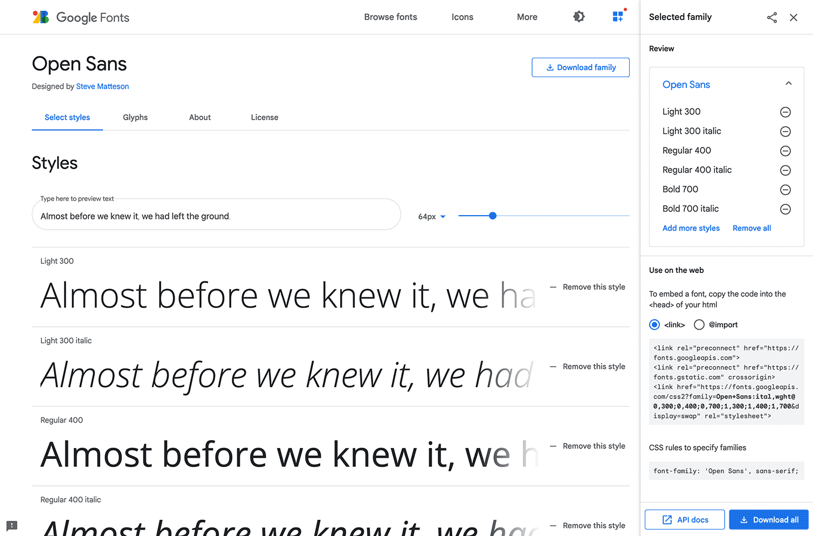
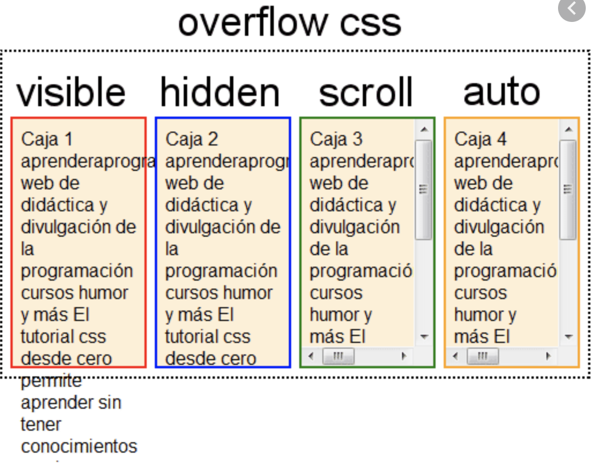
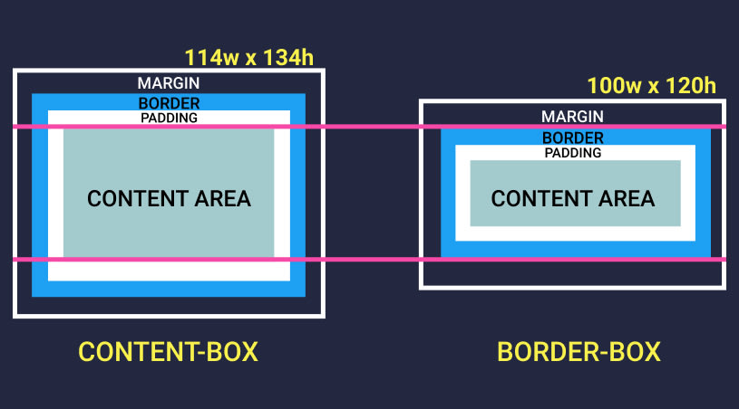

# Lesson 3 - Работа со шрифтами, свойство overflow и box-sizing

## Repeat last lesson

## 1. Каскадность, Наследование и Специфичность

* **Что такое каскадность в CSS?**
Каскадность в CSS - это механизм, позволяющий определять, какие стили будут применяться к элементам на веб-странице, когда несколько стилей конфликтуют друг с другом.

* **Что такое наследование в CSS?**
Наследование в CSS - это механизм, позволяющий элементам наследовать стили от своих родительских элементов.

* **Что такое специфичность в CSS?**
Специфичность в CSS - это механизм, позволяющий определять, какой стиль будет применяться к элементу, когда несколько стилей с одинаковой специфичностью конфликтуют друг с другом.

* **Как рассчитывается специфичность CSS-селекторов?**
Специфичность CSS-селекторов рассчитывается на основе количества и типа селекторов, используемых в правиле. Например, селектор `#id` имеет специфичность 100, селектор `.class` имеет специфичность 10, а селектор `element` имеет специфичность 1.

## 2. Flexbox

* **Что такое Flexbox в CSS?**
Flexbox - это модель позиционирования элементов в CSS, позволяющая создавать сложные макеты с помощью простых и гибких правил.

* **Какие свойства используются для создания контейнера Flexbox?**
Для создания контейнера Flexbox используется свойство `display: flex;`.

* **Какие свойства используются для расположения элементов в контейнере Flexbox?**
Для расположения элементов в контейнере Flexbox используются свойства `justify-content` и `align-items`

* **Как изменить направление расположения элементов в контейнере Flexbox?**
Направление расположения элементов в контейнере Flexbox можно изменить с помощью свойства `flex-direction`.


## 3. Git

* **Что такое Git?**
Git - это система контроля версий, позволяющая отслеживать изменения в файлах и сотрудничать с другими разработчиками.

* **Как создать новый репозиторий в Git?**
Новый репозиторий в Git можно создать с помощью команды `git init`.

* **Как добавить файлы в индекс Git?**
Файлы в индекс Git можно добавить с помощью команды `git add`.

* **Как зафиксировать изменения в Git?**
Изменения в Git можно зафиксировать с помощью команды `git commit`.

* **Как сделать коммит с сообщением в Git?**
Коммит с сообщением в Git можно сделать с помощью команды `git commit -m "сообщение"`.


## Summary

1. [Работа со шрифтами](#1-работа-со-шрифтами-в-css)
2. [Overflow Property](#2-свойство-overflow)
3. [Box-sizing](#3-свойство-box-sizing)


## 1. Работа со шрифтами в CSS
В CSS есть возможность контролировать шрифты на веб-странице. Вы можете использовать шрифты, установленные на вашем компьютере, или подключить шрифты из внешнего источника.

### 1.1 Использование системных шрифтов
В CSS есть несколько встроенных шрифтов, которые гарантированно будут доступны на любом компьютере. Вы можете использовать их, указав имя шрифта в свойстве `font-family`.

Например, вы можете использовать шрифт Arial для всего текста на вашей странице:

```css
body {
  font-family: Arial, sans-serif;
}
```


### 1.2 Локальное подключение шрифтов

Шрифты можно подключать не только из внешних источников, но и локально, с вашего компьютера. Для этого необходимо добавить файл шрифта в папку вашего проекта и использовать правило `@font-face` в CSS.

Например, вы можете подключить шрифт `myfont.ttf` из папки `fonts` следующим образом:

```css
@font-face {
  font-family: 'MyFont';
  src: url('fonts/myfont.ttf') format('truetype');
  font-weight: normal;
  font-style: normal;
}
```

Затем вы можете использовать этот шрифт в своем CSS, указав его имя в свойстве `font-family`.

```css
body {
  font-family: 'MyFont', sans-serif;
}
```

Google Fonts (https://fonts.google.com/) - это бесплатный сервис, предоставляемый Google, который позволяет легко подключать шрифты к вашему веб-сайту. Здесь вы можете найти большой выбор шрифтов, которые можно использовать для ваших проектов.


### 1.3 Подключение шрифтов из внешнего источника

Чтобы использовать шрифт, который не доступен по умолчанию, вы можете подключить его из внешнего источника, такого как Google Fonts. Для этого необходимо добавить тег `<link>` в раздел `<head>` вашей HTML-страницы.

Например, вы можете подключить шрифт Roboto из Google Fonts:

```html
<head>
  <link href="https://fonts.googleapis.com/css2?family=Roboto&display=swap" rel="stylesheet">
</head>
```

Затем вы можете использовать этот шрифт в своем CSS, указав его имя в свойстве `font-family`.

```css
body {
  font-family: 'Roboto', sans-serif;
}
```

## 2. Свойство overflow

Свойство `overflow` в CSS позволяет контролировать, как содержимое элемента будет отображаться, если оно выходит за пределы его размеров. Существует три основных значения свойства `overflow`:

### 2.1 `overflow: visible`

Это значение по умолчанию. Содержимое элемента может выходить за его пределы и будет отображаться на странице.

### 2.2 `overflow: hidden`

Содержимое элемента, которое выходит за его пределы, будет скрыто.

Например, вы можете использовать это свойство, чтобы скрыть избыток текста в блоке:

```css
.block {
  width: 200px;
  height: 100px;
  overflow: hidden;
}
```

### 2.3 `overflow: scroll` / `overflow: auto`

Эти значения добавляют скроллбары к элементу, позволяя пользователю просматривать содержимое, которое выходит за его пределы. Разница между ними заключается в том, что `overflow: scroll` всегда отображает скроллбары, в то время как `overflow: auto` отображает их только когда содержимое выходит за пределы элемента.

Например, вы можете использовать это свойство, чтобы добавить скроллбары к блоку:

```css
.block {
  width: 200px;
  height: 100px;
  overflow: auto;
}
```



## 3. Свойство box-sizing

Свойство `box-sizing` в CSS позволяет контролировать, как ширина и высота элемента рассчитываются. Существуют два основных значения свойства `box-sizing`:

### 3.1 `box-sizing: content-box`

Это значение по умолчанию. Ширина и высота элемента рассчитываются только на основе его содержимого, без учета padding и border.

Например, если у элемента `div` ширина 200 пикселей, padding 20 пикселей и border 1 пиксель, то его фактическая ширина будет 242 пикселя.

```css
div {
  width: 200px;
  padding: 20px;
  border: 1px solid black;
  box-sizing: content-box;
}
```

### 3.2 `box-sizing: border-box`

Ширина и высота элемента рассчитываются с учетом padding и border. Это значение часто используется для создания более предсказуемых макетов, так как вы можете установить фиксированную ширину и высоту элемента и быть уверенным, что padding и border не будут увеличивать его размеры.

Например, если у элемента `div` ширина 200 пикселей, padding 20 пикселей и border 1 пиксель, то его фактическая ширина будет 200 пикселей, а padding и border будут взяты из этой ширины.

```css
div {
  width: 200px;
  padding: 20px;
  border: 1px solid black;
  box-sizing: border-box;
}
```

На картинке ниже мы можем увидеть как задаются размеры элементу при border-box и при content-box. Розовая граница отображает каким частям блока будут заданы width и height
