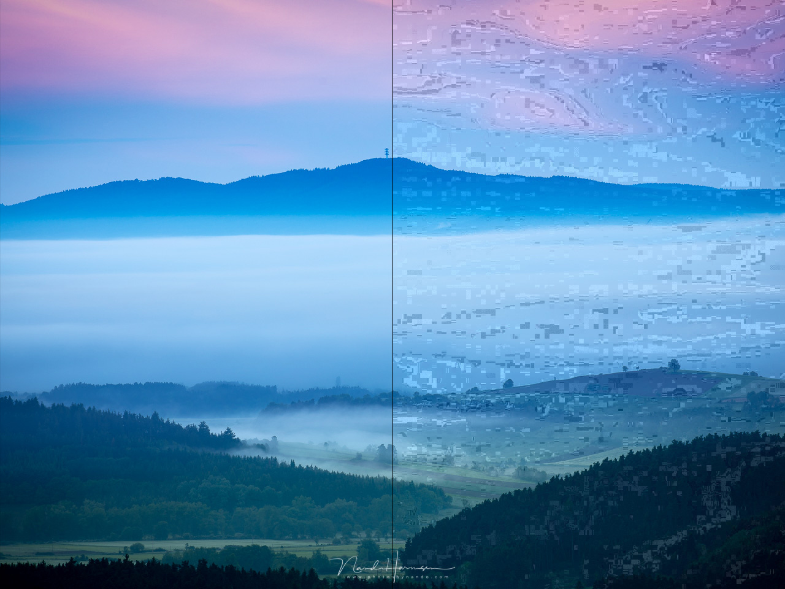
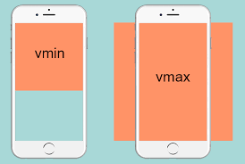

# Lesson 4

## Repeat last lesson

```
## Что такое селектор, какие селекторы бывают, свойста-значения
## Аттрибут, html-элемент, тег
## Блочные/Строчные элементы
## Блочная модель
```

## Summary

1. [Работа со шрифтами](#1-работа-со-шрифтами-в-css)
2. [Overflow Property](#2-свойство-overflow)
3. [Box-sizing](#3-свойство-box-sizing)


# Изображения и их форматы

Изображения являются важной частью веб-дизайна. Они помогают визуально передать информацию, привлечь внимание пользователей и сделать сайт более привлекательным. Однако, использование изображений может также негативно повлиять на производительность сайта, если они не оптимизированы или используются неправильный формат.

В этом уроке мы рассмотрим основные форматы изображений, их особенности и способы оптимизации для использования в веб-разработке.

## JPEG (JPG)

JPEG (Joint Photographic Experts Group) - это формат с потерями, подходящий для фотографий и изображений с градиентами. Он был разработан в 1992 году и является одним из самых популярных форматов изображений в Интернете.

Уровень сжатия JPEG можно регулировать, что позволяет найти баланс между качеством изображения и его размером. Однако, при слишком сильном сжатии могут появиться артефакты - видимые искажения изображения.

JPEG не поддерживает прозрачность, поэтому его нельзя использовать для создания изображений с прозрачным фоном.

Примеры использования JPEG на веб-сайтах:

- Фотографии людей, мест, продуктов и т.д.
- Фоновые изображения с градиентами или текстурами
- Картинки с большим количеством цветов и деталей


Пример JPEG изображения (оригинал/сжатый)

Существуют онлайн сервисы, которые позволяют сжимать изображения. Один из таких [freeconvert](https://www.freeconvert.com/compress-jpeg)

## PNG

PNG (Portable Network Graphics) - это формат без потерь, подходящий для графики и изображений с четкими контурами. Он был разработан в 1995 году в качестве альтернативы формату GIF.

PNG поддерживает прозрачность, что позволяет создавать изображения с прозрачным фоном. Он также поддерживает сжатие без потерь, что делает его подходящим для сохранения графических элементов, таких как логотипы и иконки.

Примеры использования PNG на веб-сайтах:

- Логотипы, иконки и другие графические элементы
- Изображения с четкими контурами и небольшим количеством цветов
- Изображения с прозрачным фоном


Пример PNG изображения

## GIF

GIF (Graphics Interchange Format) - это формат без потерь, подходящий для анимированных изображений и простых графических элементов. Он был разработан в 1987 году и является одним из самых старых форматов изображений в Интернете.

GIF поддерживает прозрачность и анимацию, что делает его подходящим для создания простых анимаций и графических элементов, таких как кнопки и значки.

GIF-файлы могут быть больше, чем PNG-файлы, поэтому их следует использовать с осторожностью.

Примеры использования GIF на веб-сайтах:

- Анимированные иконки и значки
- Простые анимации, такие как загрузочные индикаторы
- Графические элементы с небольшим количеством цветов


Пример GIF изображения

## SVG

SVG (Scalable Vector Graphics) - это векторный формат, подходящий для логотипов, иконок и других графических элементов. Он был разработан в 1999 году и является стандартом W3C.

SVG масштабируется без потери качества, что делает его подходящим для создания отзывчивых дизайнов. Он также поддерживает анимацию и взаимодействие с помощью JavaScript.

SVG-файлы могут быть больше, чем растровые изображения, поэтому их следует оптимизировать перед использованием на веб-сайте.

Примеры использования SVG на веб-сайтах:

- Логотипы и иконки
- Графические элементы, требующие масштабирования
- Интерактивные графики и диаграммы


Пример SVG изображения


Пример анимированного SVG изображения

## WebP

WebP - это современный формат изображений, разработанный Google. Он поддерживает как сжатие с потерями, так и без потерь, а также анимацию. WebP создан для улучшения производительности веб-сайтов и является альтернативой форматам JPEG, PNG и GIF.

WebP может быть использован для создания анимированных изображений, а также для сохранения фотографий и графических элементов. Он обеспечивает более высокое качество изображения при меньшем размере файла, чем другие форматы.

Однако, WebP не поддерживается во всех браузерах, поэтому необходимо предоставлять альтернативные форматы изображений для пользователей старых браузеров.

Примеры использования WebP на веб-сайтах:

- Фотографии людей, мест, продуктов и т.д.
- Фоновые изображения с градиентами или текстурами
- Картинки с большим количеством цветов и деталей
- Анимированные иконки и значки


Пример WebP изображения


Пример анимированного WebP изображения

## Оптимизация изображений

Оптимизация изображений может значительно улучшить производительность веб-сайта. Существует несколько способов оптимизации изображений для веб-разработки:

- Сжатие изображений - уменьшение размера файла изображения без существенной потери качества. Сжатие можно выполнять с помощью графического редактора или онлайн-инструментов, таких как TinyPNG или ImageOptim.
- Изменение размера изображений - изменение размера изображения в соответствии с размерами контейнера на веб-странице. Это позволяет избежать загрузки изображений большего размера, чем необходимо.
- Lazy loading - отложенная загрузка изображений, которые не попадают в зону видимости пользователя при первоначальной загрузке страницы. Это позволяет ускорить загрузку страницы и сократить объем трафика.

Примеры использования оптимизации изображений на веб-сайтах:

- Сжатие изображений для уменьшения размера файла и ускорения загрузки страницы
- Изменение размера изображений для адаптации к различным устройствам и экранам
- Lazy loading для ускорения загрузки страницы и экономии трафика

**Lazy loading** (отложенная загрузка) изображений в HTML можно реализовать с помощью атрибута *loading* у тега img. Этот атрибут позволяет браузеру отложить загрузку изображения до момента, когда оно появится в зоне видимости пользователя.

Атрибут loading может принимать следующие значения:

**lazy** - отложенная загрузка изображения, когда оно появится в зоне видимости пользователя;
**eager** - загрузка изображения сразу после загрузки страницы;
**auto** - браузер самостоятельно определяет, когда загружать изображение.
Пример использования атрибута loading для lazy loading изображения:

```html

```
Этот код устанавливает атрибут loading со значением lazy для изображения image.jpg, что говорит браузеру отложить загрузку изображения до момента, когда оно появится в зоне видимости пользователя.

## Итог

Выбор правильного формата изображения и его оптимизация могут значительно улучшить производительность веб-сайта. Необходимо учитывать особенности каждого формата при выборе изображения для конкретной задачи. Оптимизация изображений должна быть частью любого проекта веб-разработки.


---


## Псевдоэлементы и псевдоклассы CSS 

**Введение**

Псевдоэлементы и псевдоклассы CSS являются мощными инструментами для верстальщиков, которые позволяют им достигать различных визуальных эффектов и улучшать взаимодействие с пользователем.

**Что такое псевдоэлементы и псевдоклассы?**

Псевдоэлементы и псевдоклассы - это особые конструкции в CSS, которые позволяют применять стили к определенным частям элементов или к элементам в зависимости от их состояния.

* Псевдоэлементы позволяют стилизовать части элемента, которые не представлены в разметке HTML, например, первую букву в тексте или добавление контента перед или после элемента.
* Псевдоклассы позволяют стилизовать элементы в зависимости от их состояния, например, при наведении мыши, активном состоянии или просмотре контента.

**Псевдоэлементы**

Псевдоэлементы начинаются с двух двоеточий `::`. Ниже приведены некоторые распространенные псевдоэлементы:

1. `::before` - добавляет контент перед элементом.
2. `::after` - добавляет контент после элемента.
3. `::first-letter` - стилизует первую букву текста в элементе.
4. `::first-line` - стилизует первую строку текста в элементе.

**Примеры использования псевдоэлементов:**

```html
<!DOCTYPE html>
<html lang="en">
<head>
  <meta charset="UTF-8">
  <meta name="viewport" content="width=device-width, initial-scale=1.0">
  <style>
    p::before {
      content: "Новое предложение: ";
      font-weight: bold;
    }
    p::after {
      content: " (конец)";
      font-style: italic;
    }
    p::first-letter {
      font-size: 1.5em;
      color: red;
    }
    p::first-line {
      text-transform: uppercase;
    }
  </style>
</head>
<body>
  <p>Это простой абзац для демонстрации псевдоэлементов.</p>
</body>
</html>
```

**Псевдоклассы**

Псевдоклассы начинаются с одного двоеточия `:`. Ниже приведены некоторые распространенные псевдоклассы:

1. `:hover` - применяет стили при наведении мыши на элемент.
2. `:active` - применяет стили при активном состоянии элемента (например, при нажатии на кнопку).
3. `:focus` - применяет стили к элементу, когда он находится в фокусе (например, при клике на поле ввода).
4. `:visited` - применяет стили к ссылке, по которой уже переходили.

**Примеры использования псевдоклассов:**

```html
<!DOCTYPE html>
<html lang="en">
<head>
  <meta charset="UTF-8">
  <meta name="viewport" content="width=device-width, initial-scale=1.0">
  <style>
    a:hover {
      color: red;
    }
    button:active {
      background-color: green;
    }
    input:focus {
      border: 2px solid blue;
    }
    a:visited {
      color: purple;
    }
  </style>
</head>
<body>
  <a href="#">Ссылка</a>
  <button>Кнопка</button>
  <input type="text" placeholder="Поле ввода">
</body>
</html>
```

**Заключение**

Псевдоэлементы и псевдоклассы CSS - это мощные инструменты, которые помогают верстальщикам создавать разнообразные визуальные эффекты и улучшать взаимодействие с пользователями.

---

## Единицы измерения в CSS

В CSS существует несколько типов единиц измерения, которые используются для определения размеров, расстояний и прочих свойств элементов. В этом уроке мы рассмотрим основные единицы измерения и их использование в CSS.

### Абсолютные единицы измерения

Абсолютные единицы измерения основаны на физических единицах измерения, таких как дюймы, сантиметры или пиксели.

* `px` (пиксели) - наиболее распространенная единица измерения в CSS. Один пиксель соответствует одному пикселю на экране устройства. Однако, стоит учитывать, что разрешение экранов различается, и один пиксель на одном устройстве может выглядеть иначе, чем на другом.
* `pt` (точки) - единица измерения, используемая в печати. Один пункт равен 1/72 дюйма. В CSS используется редко, так как не всегда корректно отображается на экранах.
* `pc` (пики) - единица измерения, равная 12 точкам. Используется редко.
* `in` (дюймы), `cm` (сантиметры), `mm` (миллиметры) - единицы измерения, основанные на физических размерах. Используются редко, в основном для печати.

Пример использования абсолютных единиц измерения:
```css
div {
  width: 300px;
  height: 200px;
  margin: 1cm;
}
```
Этот код устанавливает ширину и высоту элемента `div` в 300 и 200 пикселей соответственно, а также отступ вокруг элемента в 1 сантиметр.

**Viewport** (область просмотра) - это видимая часть веб-страницы, которая отображается на экране устройства пользователя. Это область, в которой пользователь может просматривать и взаимодействовать с контентом веб-страницы.

### Относительные единицы измерения

Относительные единицы измерения основаны на размерах других элементов или свойств.

* `em` - единица измерения, равная размеру шрифта элемента. Например, если размер шрифта элемента равен 16 пикселям, то 1em будет равен 16 пикселям.
* `rem` - единица измерения, равная размеру шрифта корневого элемента (`html`). Например, если размер шрифта корневого элемента равен 16 пикселям, то 1rem будет равен 16 пикселям.
* `vw` (viewport width) - единица измерения, равная 1% ширины области просмотра (viewport). Например, если ширина области просмотра равна 1000 пикселей, то 1vw будет равен 10 пикселям.
* `vh` (viewport height) - единица измерения, равная 1% высоты области просмотра.
* `vmin` (viewport minimum) - единица измерения, равная 1% наименьшего измерения области просмотра (ширины или высоты).
* `vmax` (viewport maximum) - единица измерения, равная 1% наибольшего измерения области просмотра.


Наглядный пример как будет выглядеть блоки в 100vmin и 100vmax

Пример использования относительных единиц измерения:
```css
html {
  font-size: 16px;
}

div {
  width: 50%;
  height: 20em;
  margin: 1rem;
  padding: 2vw;
}
```
Этот код устанавливает размер шрифта корневого элемента в 16 пикселей, ширину элемента `div` в 50% от ширины родительского элемента, высоту в 20em (равно 20 размерам шрифта элемента), отступ вокруг элемента в 1rem (равно размеру шрифта корневого элемента) и внутренние отступы в 2% от ширины области просмотра.

### Дольные единицы измерения

Дольные единицы измерения используются для задания долей от других свойств.

* `%` (проценты) - единица измерения, равная доле от другого свойства. Например, ширина элемента в 50% будет равна половине ширины родительского элемента.
* `fr` (fraction) - единица измерения, используемая в CSS Grid Layout для задания долей от свободного пространства контейнера.

Пример использования дольных единиц измерения:
```css
.container {
  display: grid;
  grid-template-columns: 1fr 2fr 1fr;
}

.item {
  width: 50%;
  height: 100%;
}
```
Этот код создает контейнер с тремя колонками, ширина которых соответствует долям от свободного пространства контейнера (1fr, 2fr и 1fr), и элемент `.item` с шириной в 50% от ширины родительского элемента и высотой в 100% от высоты родительского элемента.

### Итог

Выбор правильной единицы измерения зависит от конкретной задачи и дизайна. Абсолютные единицы измерения лучше подходят для элементов, размер которых не должен меняться при изменении размера экрана или шрифта, а относительные и дольные единицы измерения позволяют создавать отзывчивый дизайн, адаптирующийся под различные устройства и разрешения экранов.
